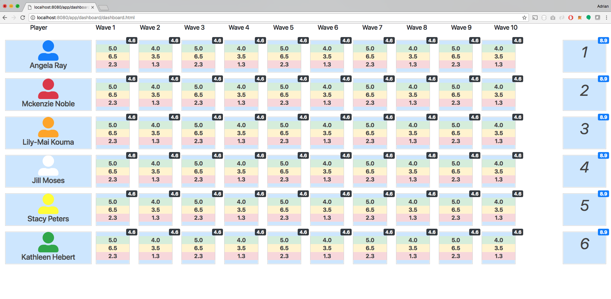

# MultiColumn Bootstrap Dashboard
Example of a bootstrap dashboard example with 14 columns



## Customize Bootstrap
Download [Bootstrap sources](https://getbootstrap.com/docs/4.0/getting-started/download/)
Extract and navigate into the bootstrap source folder
```
npm install
```
Change $grid-columns value from ../bootstrap-4.1.0/scss/_variables.scss
```
npm run css
```
Copy generated file from .../bootstrap-4.1.0/dist/css/bootstrap.min.css

## Running this app
```
npm install
npm start
```
Navigate to http://localhost:8080/
